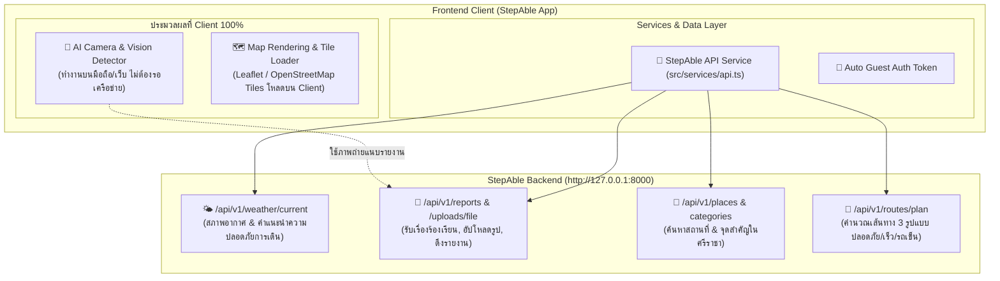

# แผนการเชื่อมต่อ StepAble Frontend กับ Backend API (Swagger UI)

อ้างอิงจาก Backend API ที่กำลังรันอยู่ที่ **[StepAble API - Swagger UI](http://127.0.0.1:8000/docs)** และความต้องการที่ให้ **AI และการโหลด Map รันที่ Client/Frontend** โดยตรง

---

## 1. การแบ่งหน้าที่ระบบ (Architecture & Boundary)

---

## 2. สิ่งที่เก็บไว้ทำที่ Client (ตามที่ระบุ)

| ส่วนงาน | รายละเอียดการทำงานที่ Client |
| :--- | :--- |
| **🤖 AI Camera & Object Detection** | - รันการตรวจจับสิ่งกีดขวาง/ทางเท้าบน Client (On-device/Heuristic Model) ใน [`src/services/ai.ts`](file:///c:/Users/hemux/OneDrive/Desktop/srapFrontend/Stepable-fe/src/services/ai.ts) - ไม่ต้องส่งเฟรมภาพวิดีโอสดทุก 3 วินาทีขึ้น Server ให้เปลืองเน็ตและหน่วง - เสียงสังเคราะห์ (Text-to-Speech) และสัญญาณสั่นเตือนรันบนเครื่องทันที |
| **🗺️ การโหลดและแสดงผลแผนที่ (Map)** | - คอมโพเนนต์ [`OpenStreetMap.tsx`](file:///c:/Users/hemux/OneDrive/Desktop/srapFrontend/Stepable-fe/src/components/maps/OpenStreetMap.tsx) และ [`OpenStreetMap.web.tsx`](file:///c:/Users/hemux/OneDrive/Desktop/srapFrontend/Stepable-fe/src/components/maps/OpenStreetMap.web.tsx) โหลด Tiles แผนที่ OpenStreetMap / MapTiler บน Client โดยตรง - ปักหมุด วาดเส้นทาง และจับตำแหน่ง GPS ปัจจุบันบนเครื่อง |

---

## 3. สิ่งที่จะเชื่อมต่อกับ StepAble API (Swagger UI)

| ฟีเจอร์ | Endpoint ใน Swagger | ไฟล์ที่แก้ไขใน Frontend | การเปลี่ยนแปลง |
| :--- | :--- | :--- | :--- |
| **🔑 การยืนยันตัวตนอัตโนมัติ** | `POST /api/v1/auth/guest` | [`src/services/api.ts`](file:///c:/Users/hemux/OneDrive/Desktop/srapFrontend/Stepable-fe/src/services/api.ts) | ขอ Guest Token อัตโนมัติเมื่อเปิดแอป และเก็บไว้ใน `AsyncStorage` เพื่อใช้แนบ Header `Authorization: Bearer <token>` |
| **🌤️ สภาพอากาศ & ความปลอดภัย** | `GET /api/v1/weather/current` | [`src/providers/app-data/AppDataProvider.tsx`](file:///c:/Users/hemux/OneDrive/Desktop/srapFrontend/Stepable-fe/src/providers/app-data/AppDataProvider.tsx) | เปลี่ยนจาก Open-Meteo ดิบ มาใช้ API ของระบบ ซึ่งมี `advisory` (คำแนะนำเตือนพื้นลื่น) และ `isSafeForWalking` |
| **📷 อัปโหลดรูปภาพปัญหา** | `POST /api/v1/uploads/file` | [`src/features/report-issue/ReportIssuePage.tsx`](file:///c:/Users/hemux/OneDrive/Desktop/srapFrontend/Stepable-fe/src/features/report-issue/ReportIssuePage.tsx) | เมื่อผู้ใช้ถ่ายรูปหรือเลือกรูปปัญหา ส่งขึ้น Endpoint นี้เพื่อได้ `publicUrl` ถาวร |
| **🚩 ส่งรายงานปัญหา (Report)** | `POST /api/v1/reports` | [`src/features/report-issue/ReportIssuePage.tsx`](file:///c:/Users/hemux/OneDrive/Desktop/srapFrontend/Stepable-fe/src/features/report-issue/ReportIssuePage.tsx) | เปลี่ยนจากเดิมที่เซฟลงแคชเครื่องเท่านั้น เป็นการส่งข้อมูลเข้า Backend DB จริง พร้อมแสดงแจ้งเตือนสำเร็จ |
| **🔔 แสดงรายการแจ้งเตือน/ปัญหา** | `GET /api/v1/reports` | [`src/features/alerts/AlertsPage.tsx`](file:///c:/Users/hemux/OneDrive/Desktop/srapFrontend/Stepable-fe/src/features/alerts/AlertsPage.tsx) | ดึงรายงานปัญหาจริงจากระบบมาแสดงสถานะ (ส่งแล้ว, ตรวจสอบแล้ว, กำลังซ่อม, แก้ไขแล้ว) พร้อมหมุดบนแผนที่ |
| **📍 ค้นหาสถานที่ & หมวดหมู่** | `GET /api/v1/places` `GET /api/v1/place-categories` | [`src/features/search/SearchPage.tsx`](file:///c:/Users/hemux/OneDrive/Desktop/srapFrontend/Stepable-fe/src/features/search/SearchPage.tsx) | ค้นหาสถานที่ในฐานข้อมูลศรีราชา (เช่น โรบินสัน, เซ็นทรัล, สวนสาธารณะ) พร้อมคะแนนความปลอดภัย `safeScore` |
| **🚶 วางแผนเส้นทางเดินเท้า** | `POST /api/v1/routes/plan` | [`src/services/geo.ts`](file:///c:/Users/hemux/OneDrive/Desktop/srapFrontend/Stepable-fe/src/services/geo.ts) [`src/features/routes/RoutesPage.tsx`](file:///c:/Users/hemux/OneDrive/Desktop/srapFrontend/Stepable-fe/src/features/routes/RoutesPage.tsx) | รับ 3 ทางเลือกจริงจากเซิร์ฟเวอร์: ปลอดภัยที่สุด, เร็วที่สุด, สำหรับรถเข็น พร้อมคำเตือนสิ่งกีดขวางบนทางเท้า |

---

## 4. ขั้นตอนการดำเนินงานทีละสเต็ป (Step-by-Step Implementation)

1. **สเต็ปที่ 1: ตั้งค่า Base API Service และ Client AI**
   - ตรวจสอบ [`src/services/api.ts`](file:///c:/Users/hemux/OneDrive/Desktop/srapFrontend/Stepable-fe/src/services/api.ts) สำหรับเชื่อมต่อ `http://127.0.0.1:8000/api/v1` และระบบ Guest Auth Token
   - ปรับ [`src/services/ai.ts`](file:///c:/Users/hemux/OneDrive/Desktop/srapFrontend/Stepable-fe/src/services/ai.ts) ให้ทำงานที่ Client อย่างสมบูรณ์ (Fast on-device heuristic detection) ไม่ต้องพึ่งพิง Backend AI

2. **สเต็ปที่ 2: เชื่อมต่อรายงานปัญหา (Report Issue) & อัปโหลดรูปภาพ**
   - อัปเดต [`ReportIssuePage.tsx`](file:///c:/Users/hemux/OneDrive/Desktop/srapFrontend/Stepable-fe/src/features/report-issue/ReportIssuePage.tsx):
     - อัปโหลดรูปไปที่ `POST /api/v1/uploads/file`
     - ยิง `POST /api/v1/reports` ส่งข้อมูลไปยัง Backend จริง
   - อัปเดต [`AlertsPage.tsx`](file:///c:/Users/hemux/OneDrive/Desktop/srapFrontend/Stepable-fe/src/features/alerts/AlertsPage.tsx):
     - โหลดข้อมูลจาก `GET /api/v1/reports` แสดงรายงานจริงจาก Server ร่วมกับหมุดบนแผนที่

3. **สเต็ปที่ 3: เชื่อมต่อ Weather & Places & Route Planning**
   - อัปเดต [`AppDataProvider.tsx`](file:///c:/Users/hemux/OneDrive/Desktop/srapFrontend/Stepable-fe/src/providers/app-data/AppDataProvider.tsx): ดึงข้อมูลอากาศและคำแนะนำเดินเท้าจาก `GET /api/v1/weather/current`
   - อัปเดต [`geo.ts`](file:///c:/Users/hemux/OneDrive/Desktop/srapFrontend/Stepable-fe/src/services/geo.ts) และ [`SearchPage.tsx`](file:///c:/Users/hemux/OneDrive/Desktop/srapFrontend/Stepable-fe/src/features/search/SearchPage.tsx): ดึงข้อมูลสถานที่ในศรีราชาจาก `GET /api/v1/places`
   - อัปเดต [`RoutesPage.tsx`](file:///c:/Users/hemux/OneDrive/Desktop/srapFrontend/Stepable-fe/src/features/routes/RoutesPage.tsx): ดึง 3 เส้นทางอัจฉริยะจาก `POST /api/v1/routes/plan`

4. **สเต็ปที่ 4: ตรวจสอบและทดสอบความถูกต้อง**
   - รัน `npx tsc --noEmit` เพื่อทดสอบว่าไม่มี Type Error
   - ทดสอบจำลองการส่งรายงานปัญหาและดูผลลัพธ์ในหน้า Alerts
